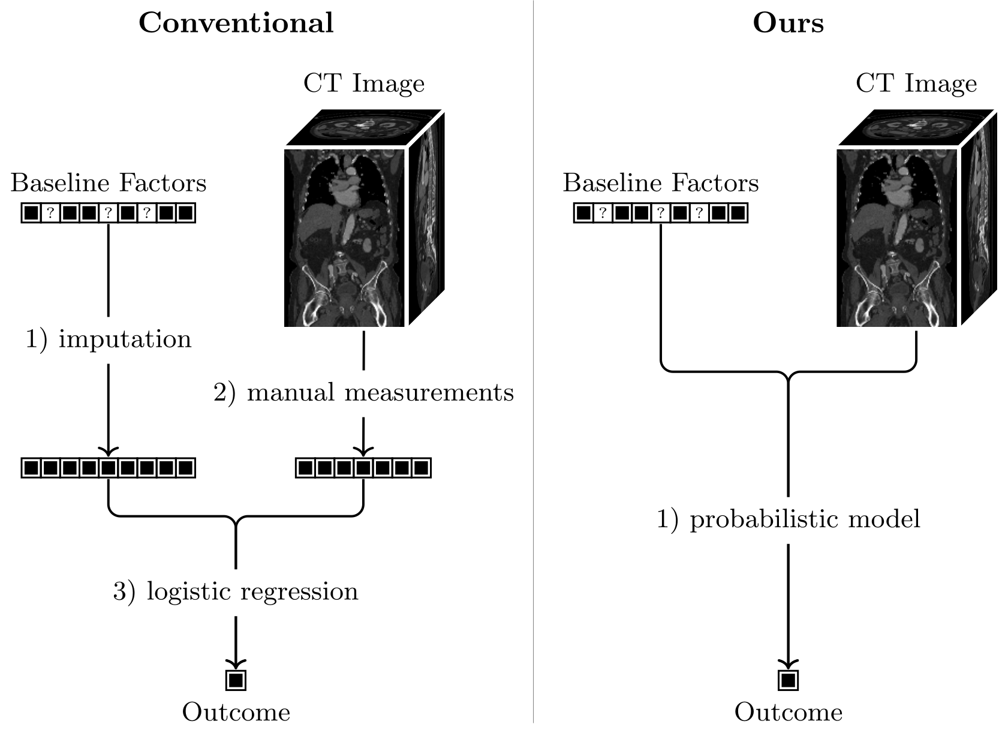

 ---

<div align="center">    
 
# Incorporating Preoperative CT in a Probabilistic Model for TAVI Outcome Prediction

<!--
[](https://www.nature.com/articles/nature14539)
[](https://papers.nips.cc/book/advances-in-neural-information-processing-systems-31-2018)  
-->

<!--
ARXIV   
[](https://www.nature.com/articles/nature14539)
-->
<!--

-->


</div>
 
## Overview

Transcatheter Aortic Valve Implantation (TAVI) is a common surgical procedure for treating patients with severe aortic stenosis. As TAVI is associated with post-surgical complications, the identification of risky patients pre-surgery is critical and currently based on surgical risk scores and clinical assessments of individual patients' characteristics. Imaging can provide invaluable information for this identification.

We propose a probabilistic model for predicting post-TAVI mortality from preoperative Computed Tomography (CT) images as well as 25 tabular baseline characteristics, on a dataset of 1449 TAVI patients.
The model seamlessly incorporates unprocessed CT volumes, by (1) automatically localizing and extracting a region of interest (ROI) encompassing the aortic root and ascending aorta and (2) extracting task-specific features via a 3D convolutional neural network.
Furthermore, the probabilistic setup allows for marginalization over missing images and tabular variables, providing a principled way of dealing with the common problem of missing data in medical settings.



Altogether, our model achieves an AUC of 0.72 for predicting death during the postoperative follow-up, comparable to the performance reached by using the manually extracted clinically relevant image measurements.
These results confirm the capability of 3D convolutional neural networks to learn image features as useful as manually extracted ones for predicting mortality after TAVI, therefore facilitate the integration of imaging information for outcome prediction in TAVI.

## Code

This repository provides [PyTorch Lightning](https://github.com/PyTorchLightning/pytorch-lightning) code for the proposed probabilistic model.
For privacy reasons we are not able to release the TAVI dataset, so we only provide the synthetic dataloader. We also provide a [script](https://github.com/brdav/tavi/blob/main/scripts/extract_roi.py) for extracting ROIs from a torso CT image based on anatomical landmarks in the ascending aorta.

### Requirements

The code is run with Python 3.8.13. To install the packages, use:
```bash
pip install -r requirements.txt
```
[W&B](https://github.com/wandb/client) is used for logging. If not previously done, use `wandb login` to log in.

### Training on Synthetic Data

Select a config file and dataset fold and start training, e.g. on CPU:

```bash
python src/main.py --cfg config/missing1_datasetsize2000.yaml --datamodule.fold 0
```

<!--
## Citation
```
@article{YourName,
  title={Your Title},
  author={Your team},
  journal={Location},
  year={Year}
}
```
-->
