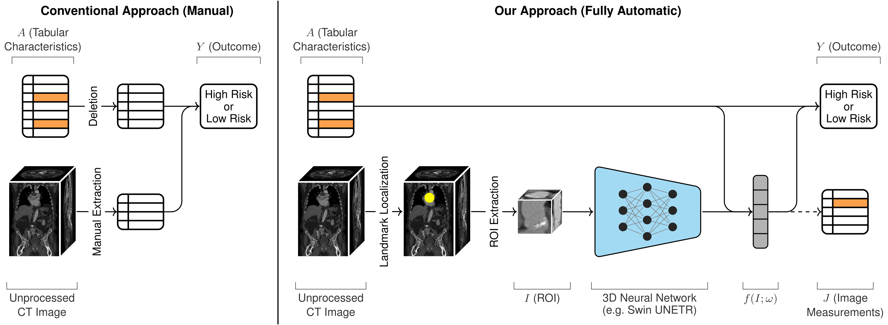

 ---

<div align="center">    
 
# Predicting Mortality after Transcatheter Aortic Valve Replacement using Preprocedural CT


</div>

The repository provides `PyTorch Lightning` code for the TAVR outcome prediction model proposed in [this Scientific Reports article](https://www.nature.com/articles/s41598-024-63022-x).
For privacy reasons we are not able to release the TAVR dataset, so training is only possible on synthetic data. 
However, we provide pretrained models and testing code for the entire localizaton/ROI extraction/classification pipeline, based on both 3D ResNet-50 and Swin UNETR. 
 
## Abstract

Transcatheter aortic valve replacement (TAVR) is a widely used intervention for patients with severe aortic stenosis. Identifying high-risk patients is crucial due to potential postprocedural complications. Currently, this involves manual clinical assessment and time-consuming radiological assessment of preprocedural computed tomography (CT) images by an expert radiologist. In this study, we introduce a probabilistic model that predicts post-TAVR mortality automatically using unprocessed, preprocedural CT and 25 baseline patient characteristics. The model utilizes CT volumes by automatically localizing and extracting a region of interest around the aortic root and ascending aorta. It then extracts task-specific features with a 3D deep neural network and integrates them with patient characteristics to perform outcome prediction. As missing measurements or even missing CT images are common in TAVR planning, the proposed model is designed with a probabilistic structure to allow for marginalization over such missing information.



Our model demonstrates an AUROC of 0.725 for predicting all-cause mortality during postprocedure follow-up on a cohort of 1449 TAVR patients. This performance is on par with what can be achieved with lengthy radiological assessments performed by experts. Thus, these findings underscore the potential of the proposed model in automatically analyzing CT volumes and integrating them with patient characteristics for predicting mortality after TAVR, thereby the potential for facilitating the integration of imaging information for TAVR outcome prediction.


## Requirements

The code is run with Python 3.8.16. Create a virtual environment (e.g. with `conda`) and install the packages with:
```bash
pip install -r requirements.txt
```

If this fails to install `onnxruntime-gpu` (e.g. on Mac OSX), install `onnxruntime` separately using `conda`:
```
conda install onnxruntime==1.14.1 -c conda-forge
```

## Predict on a Real Sample

Purely for illustration purposes, we use a sample image from the lung CT dataset of http://medicaldecathlon.com: Download [Task06_Lung.tar](https://drive.google.com/drive/folders/1HqEgzS8BV2c7xYNrZdEAnrHk7osJJ--2) and copy the image `lung_001.nii.gz` (or some other image) to `./data`. For tabular input, we use the fictional values in `./data/tabular_fictional.json`.

If you run the prediction on your own data, make sure it is in the same format. In particular, the tabular variables should have the following names and units:

| Name | Unit |
| --- | --- |
| AVA | [mm^2] |
| Age | [years] |
| Aortic_regurgitation | [score between 0 (no) and 3 (severe)] |
| BMI | [kg/m^2] |
| Creatinine | [umol/L] |
| Glomerular_filtration_rate | [mL/min/1.73m^2] |
| Hemoglobin | [g/L] |
| LVEF | [%] |
| Mean_transaortic_pressure_gradient | [mmHg] |
| Mitral_regurgitation | [score between 0 (no) and 3 (severe)] |
| Cerebrovascular_disease | binary |
| Chronic_obstructive_pulmonary_disease | binary |
| Coronary_artery_bypass_grafting | binary |
| Coronary_atheromatosis_or_stenosis | binary |
| Diabetes_mellitus | binary |
| Dyslipidemia | binary |
| Family_history_of_any_cardiovascular_disease | binary |
| Male_sex | binary |
| Hypertension | binary |
| Pacemaker_at_baseline | binary |
| Peripheral_artery_disease | binary |
| Previous_cardiovascular_interventions | binary |
| Renal_replacement_or_dialysis | binary |
| Smoking_status | binary |
| Valve_in_valve | binary |

If a variable is missing, it can simply be set to `NaN`, and it will be marginalized out during the prediction (for an example see [tabular_fictional.json](https://github.com/brdav/tavr/blob/main/data/tabular_fictional.json)).

Select the network architecture with the `--model` argument (either `swin` or `resnet`):

```bash
python -m tools.predict --image data/lung_001.nii.gz --tabular data/tabular_fictional.json --model swin
```

To illustrate the missing-image case, we can marginalize out the image input by leveraging the (fictional) manual image measurements:

```bash
python -m tools.predict --tabular data/tabular_fictional.json --measurements data/measurements_fictional.json --model swin
```

Manual image measurements need to be specified in the following format (see [measurements_fictional.json](https://github.com/brdav/tavr/blob/main/data/measurements_fictional.json)):

| Name | Unit |
| --- | --- |
| Agatston_score_aortic_valve | [score] |
| Area_derived_diameter_of_annulus_incl_calcification | [mm] |
| Area_of_annulus_incl_calcification | [mm^2] |
| Calcification_of_ascending_aorta | [score between 0 (no) and 4 (severe)] |
| Calcification_of_sinotubular_junction | [score between 0 (no) and 3 (severe)] |
| Diameter_of_ascending_aorta | [mm] |
| LVOT_area | [mm^2] |
| LVOT_maximal_diameter | [mm] |
| Maximal_annulus_diameter | [mm] |
| Maximal_diameter_of_sinotubular_junction | [mm] |
| Perimeter_of_annulus_incl_calcification | [mm] |
| Sinus_portion_maximal_diameter | [mm] |
| Volume_of_sinus_valsalva | [mm^3] |
| Volume_score_LVOT | [score] |
| Volume_score_aortic_valve | [score] |


## Training on Synthetic Data

Select a config file and start training, e.g., on CPU:

```bash
python -m tools.run fit --config configs/3d_resnet50_version_synthetic.yaml --trainer.accelerator cpu
```

This will produce training logs in `./logs/`. For testing use:

```bash
python -m tools.run test --config configs/3d_resnet50_version_synthetic.yaml --trainer.accelerator cpu --ckpt_path /path/to/trained/model.ckpt
```

## Citation

If you find this code useful in your research, please consider citing the paper:
```bibtex
@article{bruggemann2024predicting,
  title={Predicting Mortality after Transcatheter Aortic Valve Replacement using Preprocedural CT},
  author={Bruggemann, David and Kuzo, Nazar and Anwer, Shehab and Kebernik, Julia and Eberhard, Matthias and Alkadhi, Hatem and Tanner, Felix C. and Konukoglu, Ender},
  journal={Scientific Reports},
  volume={14},
  number={1},
  pages={12526},
  year={2024},
  publisher={Nature Publishing Group UK London}
}
```


## License

This repository is released under the MIT license. However, care should be taken to adopt appropriate licensing for third-party code in this repository. Third-party code is marked accordingly.
